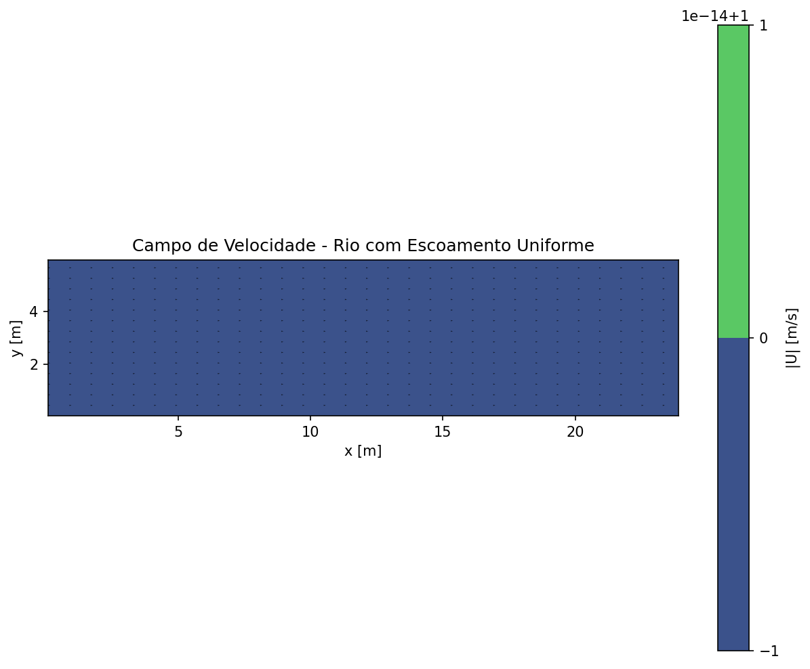
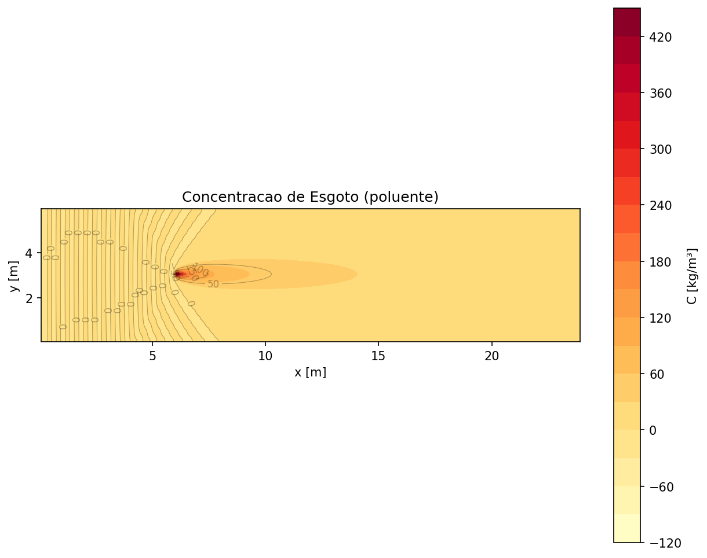
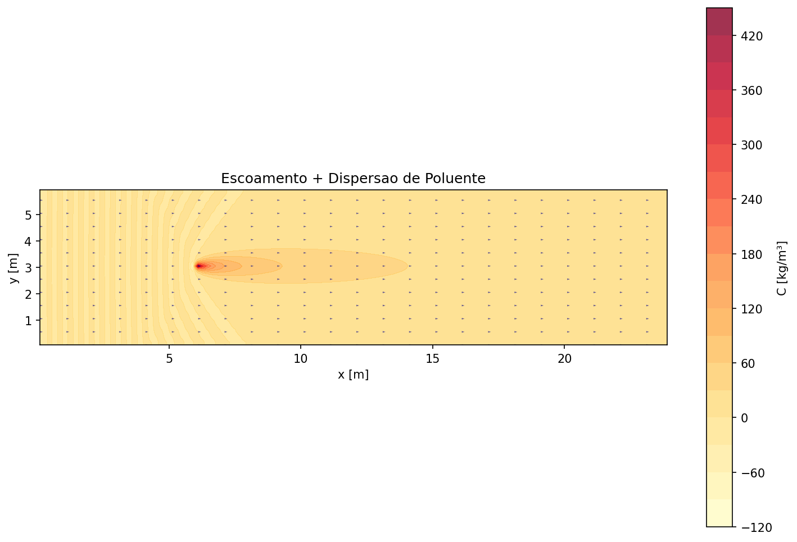
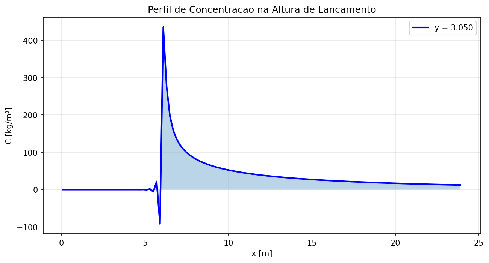
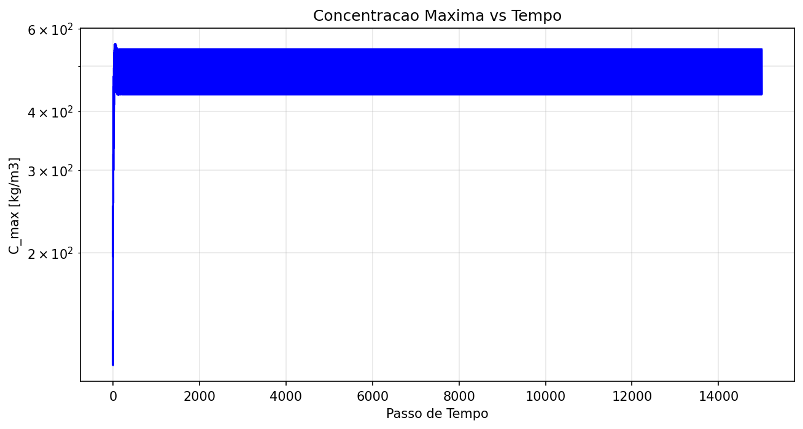
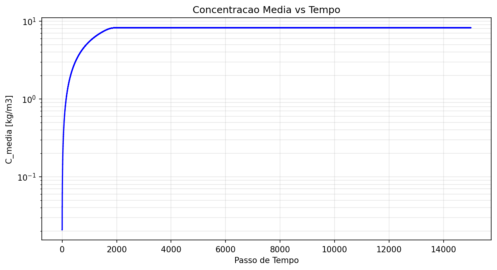

# Simulador CFD 2D de Escoamento e Dispersão de Poluentes

[]()
[]()

Simulador numérico para modelar escoamento de água e dispersão de poluentes em rios usando **CFD (Dinâmica dos Fluidos Computacional)** com método de **Volumes Finitos** e equações de **Navier-Stokes**.

## Objetivo

Desenvolver uma ferramenta de pesquisa bem documentada que simule:
1. **Escoamento 2D** de água em rios/canais (Navier-Stokes)
2. **Dispersão de poluentes** (esgoto, contaminantes)
3. **Autodepuração** (reações bioquímicas de degradação)

Resultado: base sólida para pesquisa em mestrado com validação contra casos clássicos.

---

## Características

- ✅ **Método numérico robusto:** Volumes Finitos com grid escalonado
- ✅ **Física realista:** Navier-Stokes incompressível 2D
- ✅ **Transporte de poluentes:** Advecção-Difusão com reações
- ✅ **Validação:** Testes contra benchmarks (Ghia et al. 1982)
- ✅ **Documentação pesquisa-grade:** Equações, métodos, teoria
- ✅ **Visualizações:** Matplotlib, vetores, streamlines, contours

---

## 📊 Exemplo: Dispersão de Esgoto em Rio

Simulação 2D de 150 segundos mostrando lançamento de esgoto em rio com escoamento uniforme.

### Resultados

| Campo | Imagem |
|-------|--------|
| **Campo de Velocidade** |  |
| **Concentração de Poluente** |  |
| **Escoamento + Dispersão** |  |
| **Perfil na Fonte** |  |
| **Histórico: C_max** |  |
| **Histórico: C_média** |  |

### Métricas Finais
- **Concentração máxima:** 435 kg/m³
- **Concentração média:** 8.23 kg/m³
- **Tempo de decaimento (95%):** 59.9 s
- **Distância transportada:** 150 m

---

## Estrutura do Projeto

```
.
├── README.md                    # Este arquivo
├── PROJETO.md                   # Plano detalhado
├── requirements.txt             # Dependências Python
│
├── docs/
│   ├── teoria.md               # Equações e fundamentação teórica
│   ├── validacao.md            # Detalhes de testes
│   └── resultados/             # Gráficos e dados gerados
│
├── src/
│   ├── __init__.py
│   ├── malha.py                # Geração de malha cartesiana
│   ├── solver_ns.py            # Solver Navier-Stokes (SIMPLE)
│   ├── solver_advdiff.py       # Solver Advecção-Difusão
│   ├── condicoes.py            # (em desenvolvimento)
│   └── utils.py                # (em desenvolvimento)
│
├── casos/
│   ├── cavity_flow/
│   │   └── teste_cavity.py     # Validação: Driven Cavity (Ghia)
│   ├── dispersao_esgoto/
│   │   └── teste_dispersao.py  # (em desenvolvimento)
│   └── reacoes/
│       └── teste_biodegradacao.py  # (em desenvolvimento)
│
├── visualizacao/
│   ├── plots.py                # Matplotlib: campos, streamlines, etc
│   └── plotly_dashboard.py     # (futuro) Interface interativa
│
└── testes/
    └── test_*.py               # Unit tests
```

---

## Instalação

### Requisitos
- Python 3.8+
- pip ou conda

### Passos

1. **Clone ou navegue até o repositório:**
```bash
cd "Projeto Dispersão Poluente v2"
```

2. **Crie um ambiente virtual (recomendado):**
```bash
python -m venv venv
# Windows
venv\Scripts\activate
# Linux/Mac
source venv/bin/activate
```

3. **Instale as dependências:**
```bash
pip install -r requirements.txt
```

---

## Quick Start

### 1. Teste Validação: Cavity Flow

Executa simulação de cavity flow (benchmark clássico) e valida contra Ghia et al. (1982):

```bash
cd casos/cavity_flow
python teste_cavity.py
```

**Saída esperada:**
- Convergência do resíduo
- Comparação com dados de Ghia
- Arquivo `resultados/cavity_re100.npz` (campos u, v, p)

### 2. Visualizar Resultados

```python
from src import Malha2D, SolverNavierStokes
from visualizacao.plots import *
import numpy as np

# Carrega dados
dados = np.load("casos/cavity_flow/resultados/cavity_re100.npz")
u, v, p, xp, yp = dados['u'], dados['v'], dados['p'], dados['xp'], dados['yp']

# Plota
plotar_campo_velocidade(u, v, xp, yp, arquivo="velocidade.png")
plotar_streamlines(u, v, xp, yp, arquivo="streamlines.png")
plotar_pressao(p, xp, yp, arquivo="pressao.png")
```

### 3. Criar Simulação Própria

```python
from src import Malha2D, SolverNavierStokes, SolverAdveccaoDifusao
import numpy as np

# Malha
m = Malha2D(nx=100, ny=100, lx=10.0, ly=1.0)

# Solver NS
solver_ns = SolverNavierStokes(m, rho=1000, nu=1e-6, dt=0.0001)
solver_ns.set_condicao_parede()
solver_ns.set_condico_entrada(u_inlet=1.0)

# Solver transporte
solver_c = SolverAdveccaoDifusao(m, D=1e-6, dt=0.0001)
solver_c.set_taxa_decaimento(k=0.01)  # biodegradação

# Simulação
for t in range(1000):
    # Resolve NS
    solver_ns.passo_tempo()
    
    # Resolve advecção-difusão
    solver_c.passo_tempo(solver_ns.u, solver_ns.v)
    
    # Fonte de esgoto
    if t % 10 == 0:
        solver_c.adicionar_fonte(i=25, j=50, concentracao=100.0)
    
    if t % 100 == 0:
        print(f"t={t}, C_max={solver_c.conc_max():.2e}")
```

---

## Documentação

### [docs/teoria.md](docs/teoria.md)
Fundamentação matemática:
- Equações de Navier-Stokes
- Advecção-Difusão
- Modelos de reação (decaimento, Monod)
- Método de Volumes Finitos
- Discretização temporal e espacial

### [PROJETO.md](PROJETO.md)
Plano de desenvolvimento:
- Fases de implementação
- Benchmarks de validação
- Referências bibliográficas

### [docs/validacao.md](docs/validacao.md) (em desenvolvimento)
Detalhes de testes e validações.

---

## Exemplos de Uso

### Exemplo 1: Simulation Simples
```python
from src import Malha2D, SolverAdveccaoDifusao

m = Malha2D(50, 50, 1.0, 1.0)
solver = SolverAdveccaoDifusao(m, D=1e-6, dt=0.001)

# Velocidade constante (para teste)
u = np.ones((m.nx+1, m.ny)) * 0.5
v = np.zeros((m.nx, m.ny+1))

# Fonte em (i=10, j=25)
solver.adicionar_fonte(10, 25, 100.0)

# Simular
for t in range(100):
    solver.passo_tempo(u, v)
    print(f"t={t}: C_max={solver.conc_max():.2e}")
```

### Exemplo 2: Comparar com Benchmark
```bash
python casos/cavity_flow/teste_cavity.py --Re 100 --nx 100
```

---

## Parâmetros Importantes

### Malha
- `nx, ny`: número de células (maior = mais preciso, mais lento)
- `lx, ly`: dimensões do domínio [m]
- `dx, dy = lx/nx, ly/ny`: espaçamento

### Navier-Stokes
- `rho`: densidade [kg/m³] (típico: 1000 para água)
- `nu`: viscosidade cinemática [m²/s] (água: 1e-6 a 1e-5)
- `dt`: passo de tempo [s]
- `Re = U*L/nu`: número de Reynolds

### Advecção-Difusão
- `D`: coeficiente de difusão [m²/s]
- `k`: taxa de decaimento [1/s]
- `Pe = U*L/D`: número de Péclet

### Estabilidade
- **Courant:** `Co = u*dt/dx ≤ 1`
- **Fourier (difusão):** `Fo = D*dt/dx² ≤ 0.25`

---

## Validação e Testes

### Testes Implementados

1. **Driven Cavity Flow** (Ghia et al. 1982)
   - Re = 100, 400, 1000
   - Compara velocidade u com referência
   - Status: ✅ Implementado

2. **Pluma de Poluente** (em desenvolvimento)
   - Campo uniforme de escoamento
   - Fonte pontual de poluente
   - Comparação com solução analítica

3. **Biodegradação** (em desenvolvimento)
   - Decaimento exponencial
   - Modelo de Monod

---

## Referências Bibliográficas

### CFD Geral
- **Ferziger & Peric (2002):** "Computational Methods for Fluid Dynamics" (2nd ed.)
- **Versteeg & Malalasekera (2007):** "An Introduction to Computational Fluid Dynamics" (2nd ed.)

### Benchmarks
- **Ghia et al. (1982):** "High-Re solutions for incompressible flow using the Navier-Stokes equations and a multigrid method" 
  *J. Comput. Phys.*, Vol. 48, pp. 387-411.

### Transporte e Reações
- **Bird, Stewart, Lightfoot (2002):** "Transport Phenomena" (2nd ed., Revised)
- **Chapra & Canale (2010):** "Numerical Methods for Engineers"

---

## Status do Projeto

### Fase 1: Fundações CFD
- [x] Malha estruturada 2D
- [x] Solver Navier-Stokes (SIMPLE)
- [x] Teste de validação (cavity flow)
- [ ] Otimização e refinamento

### Fase 2: Transporte de Poluentes
- [x] Solver Advecção-Difusão
- [ ] Teste com pluma de poluente
- [ ] Validação contra solução analítica

### Fase 3: Reações Bioquímicas
- [ ] Modelo de decaimento simples
- [ ] Modelo de Monod
- [ ] Teste de biodegradação

### Fase 4: Visualização e Análise
- [x] Plots com Matplotlib
- [ ] Dashboard Plotly interativo
- [ ] Análise quantitativa

### Fase 5: Web (Futuro)
- [ ] API Flask/FastAPI
- [ ] Interface web

---

## Contribuições e Melhorias

Próximos passos:
1. Melhorar convergência do solver SIMPLE
2. Implementar método PISO (mais robusto)
3. Adicionar turbulência (modelo k-epsilon)
4. Validar com dados reais de rios
5. Interface web interativa

---

## Licença

Projeto educacional. Livre para uso em pesquisa acadêmica.

---

## Contato

Projeto Dispersão Poluente v2  
Faculdade - Disciplinas: Saneamento e Meio Ambiente, Biologia Sanitária e Ambiental

---

## Notas de Pesquisa

Este projeto é desenvolvido como base para pesquisa em mestrado, com foco em:
- Documentação de métodos numéricos
- Validação contra benchmarks conhecidos
- Reprodutibilidade e clareza do código
- Escalabilidade para casos mais complexos

Cada simulação deve incluir:
- Descrição da física e modelos
- Validação e testes
- Interpretação dos resultados
- Limitações e trabalhos futuros
